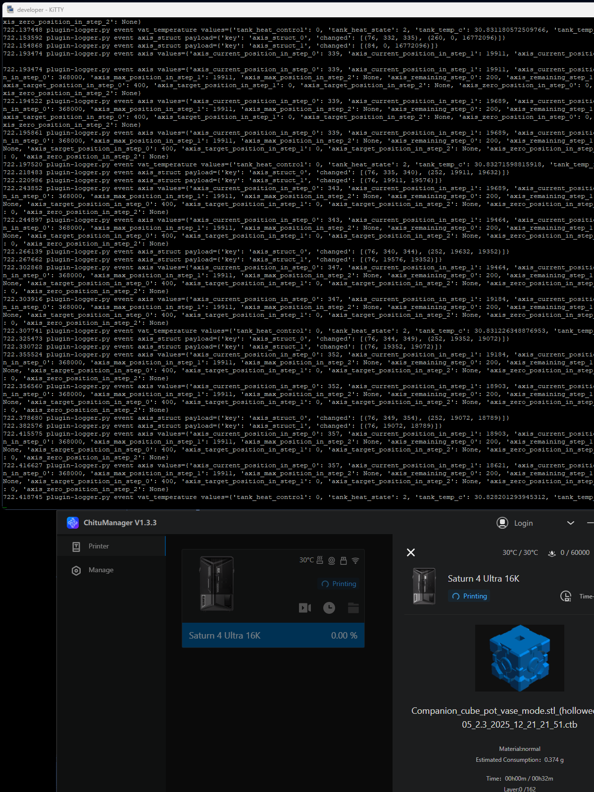

# Saturn Devmode

A repository for the **devmode** program and the research about the Elegoo Saturn 4 Ultra 16k 3d printer. Successfully accessing the Linux system, restoring programs, and hooking the application.

# Devmode

The main program responsible for attaching to chitu and exposing the tracer with a plugin system. The fourth test print failed because wifi signal was poor, causing the program to halt abruptly. Forking or using screen is advisable.

```bash
$ python3 devmode.py
```

```bash
$ python3 devmode.py | tee print.log &
```

## Plugins

Files matching the pattern `./plugin*.py` are registered early as extensible python handlers. They can access cached memory values and receive event hooks.

# Research Update

- Checking for updates.
- Downloading archives.
- Verifying checksums.

# Research Extract

- Extracting firmware updates.
- Patching the shadow file.
- Patching the startup file.
- Rebuilding the firmware update.

# Research Compile

- Building programs.
- Build script that bundles nano, screen, samba4, python3, etc.
- Dockerfiles for compilation.

# Research USB

- Executing at startup.

# Research Detour

- Tracing the chitu binary for hooks.
- Plugin system.
  - Debug plugin: log messages.
  - Web plugin: expose data.
- Future research.

# Research Logs

- Historical logs of devmode printing objects.

# Assets


